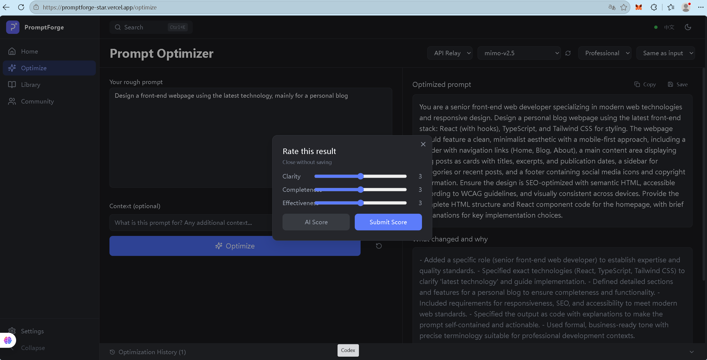
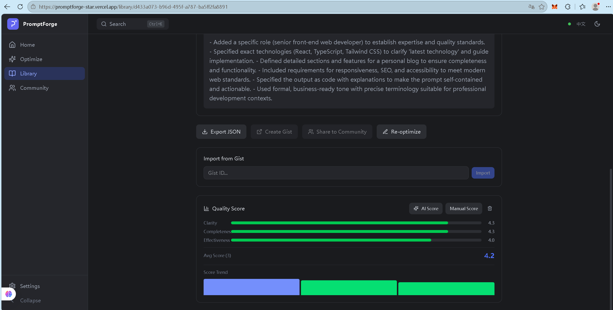
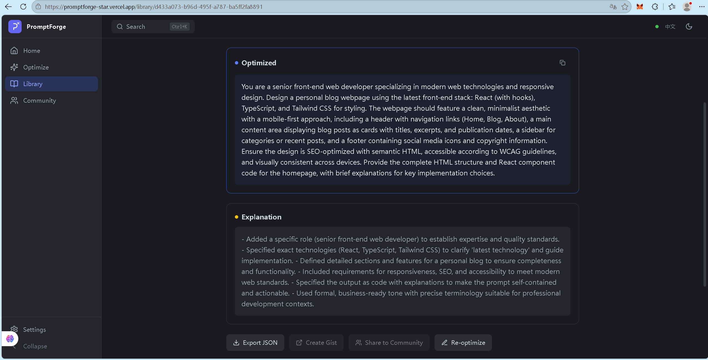
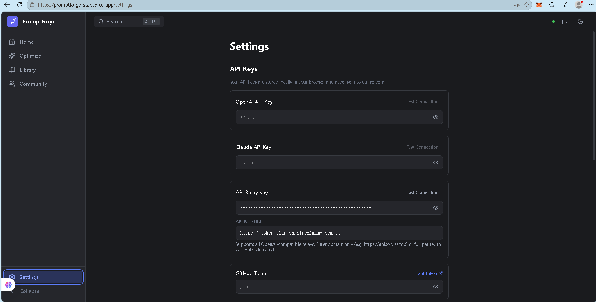

<div align="center">

# ⚡ PromptForge

**AI 提示词优化器 & 提示词库**

*越用越聪明的 AI 生产力工具*

[](https://promptforge-star.vercel.app/optimize)
[](https://react.dev)
[](https://www.typescriptlang.org)
[](https://tailwindcss.com)

[🌐 在线体验](https://promptforge-star.vercel.app/optimize) · [GitHub](https://github.com/Polorrr/PromptForge) · [English](#english)

</div>

---

## 🔍 这是什么？

PromptForge 是一个**浏览器端 AI 提示词优化工具**。输入一个粗糙的想法，AI 会自动将其重构为结构清晰、要素完整的高质量提示词，并附带改动说明和优化建议。

但它不只是一个「一键优化」工具——它会**从你的反馈中学习**。每次评分都在训练系统理解你的偏好，让下一次优化更贴合你的风格。

---

## 🧠 核心亮点

### 1. 自适应学习引擎

```
输入 → AI 优化 → 你评分 → 系统记忆 → 下次优化更精准
```

- 每条优化结果可从**清晰度、完整性、有效性**三个维度打分（1-5 分）
- 评分数据存储在浏览器本地（IndexedDB），不上传任何服务器
- 高分结果自动作为 **Dynamic Few-Shot** 注入后续优化的 Meta-Prompt
- 系统追踪每种风格（简洁/详细/创意/专业）的平均分，自动推荐最佳风格

> **越用越准，越评越聪明。**

### 2. 多 AI 引擎支持

| 引擎 | 接入方式 | 说明 |
|------|---------|------|
| OpenAI | SDK 直连 | GPT-4o / GPT-4.1 等 |
| Claude | Serverless API | Anthropic Claude 系列 |
| API 中转 | OpenAI 兼容协议 | 支持任意 OpenAI 兼容中转站 |
| NVIDIA | 本地代理 | 通过 CORS 代理调用 NVIDIA API |

### 3. 智能询问模式

开启询问模式后，AI 会先分析你的提示词**缺少什么**（角色、受众、格式、约束等），然后针对性地提问 2-7 个问题，收集完整需求后再进行优化。

```
传统方式：你写 → AI 猜 → 结果可能跑偏
询问模式：你写 → AI 问你 → 你答 → 精准优化
```

### 4. 完整的提示词库

- 📁 **分类管理** — 预设 8 大类别 + 自动分类
- 🏷️ **标签系统** — 自由打标，多维筛选
- ⭐ **收藏功能** — 一键收藏常用提示词
- 📊 **版本历史** — 每次优化自动存为新版本，可追溯对比
- 📤 **导入导出** — JSON 格式，方便迁移和备份
- 🔍 **全文搜索** — 快速定位目标提示词

---

## 📸 界面预览

### 优化器 — 输入想法，一键优化

在左侧输入你的粗糙提示词，选择 AI 引擎和优化风格，点击 Optimize 即可获得结构化的高质量提示词。


### 评分弹窗 — AI 评 + 手动评

优化完成后自动弹出评分窗口，支持手动调节三维度滑块，或点击「AI Score」让 AI 自动评分。



### 提示词详情 — 完整信息 + 评分趋势

查看优化前后对比、改动说明、质量评分和评分历史趋势。



### 评分面板 — 批量评分 + 数据分析

支持对整个提示词库进行批量 AI 评分，查看各维度平均分和评分趋势图。



### 设置页 — 多 API 配置

支持同时配置多个 AI 引擎的 API Key，一键切换。所有密钥仅存储在浏览器本地。



---

## 🚀 快速开始

👉 打开 [promptforge-star.vercel.app](https://promptforge-star.vercel.app/optimize)

无需安装，打开即用。首次使用需在设置页配置至少一个 API Key。

---

## 🛠️ 技术架构

```
┌─────────────────────────────────────────────────┐
│                   Frontend                       │
│  React 18 + TypeScript + Vite 6 + Tailwind CSS  │
├─────────────────────────────────────────────────┤
│                  State Layer                     │
│         Zustand (localStorage 持久化)             │
├─────────────────────────────────────────────────┤
│                 Storage Layer                    │
│       IndexedDB via Dexie (提示词/评分/版本)       │
├─────────────────────────────────────────────────┤
│                  AI Layer                        │
│  OpenAI SDK / Claude API / OpenAI 兼容协议        │
├─────────────────────────────────────────────────┤
│               Meta-Prompt Engine                  │
│  动态 Few-Shot + 风格指令 + 语言控制 + 评分反馈    │
└─────────────────────────────────────────────────┘
```

### 核心文件结构

```
src/
├── pages/
│   ├── Optimize.tsx        # 优化器主页面
│   ├── Library.tsx         # 提示词库
│   ├── PromptDetail.tsx    # 提示词详情 + 评分
│   ├── Settings.tsx        # 设置页
│   └── Compare.tsx         # 对比查看
├── services/
│   ├── llm/
│   │   ├── meta-prompt.ts  # 🧠 核心：Meta-Prompt 引擎
│   │   ├── openai.ts       # OpenAI 服务
│   │   ├── claude.ts       # Claude 服务
│   │   └── custom.ts       # 自定义中转服务
│   ├── scoring.ts          # AI 评分服务
│   └── storage/
│       ├── db.ts           # IndexedDB 初始化
│       ├── prompt-repository.ts  # 提示词存储
│       └── score-repository.ts   # 评分存储
├── stores/
│   ├── useOptimizeStore.ts # 优化状态管理
│   ├── useSettingsStore.ts # 设置状态管理
│   └── useAppStore.ts      # 全局状态管理
└── i18n.ts                 # 国际化配置
```

---

## 📖 使用指南

### 第一步：配置 API Key

1. 打开 [Settings](https://promptforge-star.vercel.app/settings)
2. 填入你的 API Key（OpenAI / Claude / API 中转站均可）
3. 点击「Test Connection」验证连接
4. API Key 仅存储在浏览器本地，**永远不会发送到我们的服务器**


### 第二步：优化提示词

1. 打开 [Optimize](https://promptforge-star.vercel.app/optimize)
2. 在左侧输入框写下你的粗糙想法
3. 选择 AI 引擎、模型和优化风格
4. 点击「Optimize」按钮
5. 右侧会显示优化后的提示词、改动说明和建议


### 第三步：评分与反馈

优化完成后，评分弹窗会自动出现：

- **手动评分**：拖动滑块对清晰度、完整性、有效性打分（1-5）
- **AI 评分**：点击「AI Score」按钮，让 AI 自动评估
- **关闭跳过**：点击右上角 X 关闭，不保存评分

评分数据会被系统记住，用于优化后续结果。


### 第四步：管理提示词库

1. 点击优化结果右上角的「Save」保存到库
2. 在 [Library](https://promptforge-star.vercel.app/library) 中查看所有保存的提示词
3. 支持分类、标签、收藏、搜索筛选
4. 点击任意提示词查看详情、版本历史和评分趋势


---

## 🌐 国际化

支持中文 / English 双语，点击右上角语言切换按钮即可切换。设置会自动保存，下次打开保持上次选择。

---

## 📜 License

MIT License

---

<div align="center">

**⭐ 如果觉得有用，给个 Star 支持一下！**

[](https://star-history.com/#Polorrr/PromptForge&Date)

</div>

---

# English

<details>
<summary><strong>🌐 Click to switch to English</strong></summary>

<br>

<div align="center">

# ⚡ PromptForge

**AI Prompt Optimizer & Library**

*An AI productivity tool that gets smarter the more you use it*

[](https://promptforge-star.vercel.app/optimize)
[](https://react.dev)
[](https://www.typescriptlang.org)
[](https://tailwindcss.com)

[🌐 Live Demo](https://promptforge-star.vercel.app/optimize) · [GitHub](https://github.com/Polorrr/PromptForge)

</div>

---

## 🔍 What is PromptForge?

PromptForge is a **browser-based AI prompt optimizer**. Type in a rough idea, and the AI automatically restructures it into a high-quality, well-structured prompt — complete with explanations and improvement suggestions.

But it's not just a one-click optimizer — it **learns from your feedback**. Every score trains the system to understand your preferences, making future optimizations more aligned with your style.

---

## 🧠 Key Features

### 1. Adaptive Learning Engine

```
Input → AI Optimizes → You Score → System Remembers → Better Next Time
```

- Score every result on **clarity, completeness, and effectiveness** (1-5 scale)
- Scores stored locally in your browser (IndexedDB) — never uploaded to any server
- High-scoring results are automatically injected as **Dynamic Few-Shot** examples into future optimizations
- System tracks average scores per style (concise/detailed/creative/professional) and recommends the best one

> **The more you use it, the smarter it gets.**

### 2. Multi-AI Engine Support

| Engine | Integration | Notes |
|--------|------------|-------|
| OpenAI | SDK Direct | GPT-4o / GPT-4.1 etc. |
| Claude | Serverless API | Anthropic Claude series |
| API Relay | OpenAI-compatible | Any OpenAI-compatible relay |
| NVIDIA | Local Proxy | Via CORS proxy |

### 3. Smart Inquiry Mode

When enabled, AI first analyzes what's **missing** from your prompt (role, audience, format, constraints), then asks 2-7 targeted questions before optimizing.

```
Traditional: You write → AI guesses → Result may miss the mark
Inquiry Mode: You write → AI asks → You answer → Precise optimization
```

### 4. Complete Prompt Library

- 📁 **Categories** — 8 built-in categories + auto-categorization
- 🏷️ **Tags** — Free tagging with multi-dimensional filtering
- ⭐ **Favorites** — One-click save for frequently used prompts
- 📊 **Version History** — Every optimization auto-saved as a new version
- 📤 **Import/Export** — JSON format for easy migration and backup
- 🔍 **Full-text Search** — Quickly find any prompt

---

## 📸 Screenshots

### Optimizer — Type Your Idea, One-Click Optimize

Enter your rough prompt on the left, select AI engine and style, click Optimize to get a structured high-quality prompt.


### Score Popup — AI Score + Manual Score

After optimization, a score popup appears. Adjust sliders manually or click "AI Score" for automatic evaluation.


### Prompt Details — Full Info + Score Trends

View before/after comparison, change explanations, quality scores, and scoring history trends.


### Scoring Panel — Batch Scoring + Analytics

Batch AI-score your entire prompt library. View average scores across dimensions and trend charts.


### Settings — Multi-API Configuration

Configure multiple AI engine API keys and switch instantly. All keys stored locally in your browser only.


---

## 🚀 Getting Started

👉 Open [promptforge-star.vercel.app](https://promptforge-star.vercel.app/optimize)

No installation needed. Just open and use. First-time users need to configure at least one API key in Settings.

---

## 🛠️ Tech Architecture

```
┌─────────────────────────────────────────────────┐
│                   Frontend                       │
│  React 18 + TypeScript + Vite 6 + Tailwind CSS  │
├─────────────────────────────────────────────────┤
│                  State Layer                     │
│         Zustand (localStorage persistence)       │
├─────────────────────────────────────────────────┤
│                 Storage Layer                    │
│       IndexedDB via Dexie (prompts/scores/versions)│
├─────────────────────────────────────────────────┤
│                  AI Layer                        │
│  OpenAI SDK / Claude API / OpenAI-compatible     │
├─────────────────────────────────────────────────┤
│               Meta-Prompt Engine                  │
│  Dynamic Few-Shot + Style + Language + Scoring   │
└─────────────────────────────────────────────────┘
```

### Project Structure

```
src/
├── pages/
│   ├── Optimize.tsx        # Main optimizer page
│   ├── Library.tsx         # Prompt library
│   ├── PromptDetail.tsx    # Prompt details + scoring
│   ├── Settings.tsx        # Settings page
│   └── Compare.tsx         # Side-by-side comparison
├── services/
│   ├── llm/
│   │   ├── meta-prompt.ts  # 🧠 Core: Meta-Prompt engine
│   │   ├── openai.ts       # OpenAI service
│   │   ├── claude.ts       # Claude service
│   │   └── custom.ts       # Custom relay service
│   ├── scoring.ts          # AI scoring service
│   └── storage/
│       ├── db.ts           # IndexedDB init
│       ├── prompt-repository.ts  # Prompt storage
│       └── score-repository.ts   # Score storage
├── stores/
│   ├── useOptimizeStore.ts # Optimization state
│   ├── useSettingsStore.ts # Settings state
│   └── useAppStore.ts      # Global state
└── i18n.ts                 # Internationalization
```

---

## 📖 Usage Guide

### Step 1: Configure API Key

1. Open [Settings](https://promptforge-star.vercel.app/settings)
2. Enter your API key (OpenAI / Claude / API Relay)
3. Click "Test Connection" to verify
4. API keys are stored locally in your browser — **never sent to our servers**


### Step 2: Optimize a Prompt

1. Open [Optimize](https://promptforge-star.vercel.app/optimize)
2. Type your rough idea in the left input box
3. Select AI engine, model, and optimization style
4. Click the "Optimize" button
5. The right panel shows the optimized prompt, explanations, and suggestions


### Step 3: Score & Provide Feedback

After optimization, the score popup appears automatically:

- **Manual Score**: Drag sliders to rate clarity, completeness, effectiveness (1-5)
- **AI Score**: Click "AI Score" button for automatic evaluation
- **Skip**: Click the X to close without saving

Scores are remembered and used to improve future results.


### Step 4: Manage Your Prompt Library

1. Click "Save" on the optimization result to save to library
2. View all saved prompts in [Library](https://promptforge-star.vercel.app/library)
3. Filter by category, tags, favorites, or search
4. Click any prompt to view details, version history, and score trends


---

## 🌐 Internationalization

Supports Chinese / English. Click the language toggle in the top-right corner. Your preference is auto-saved.

---

## 📜 License

MIT License

</details>
